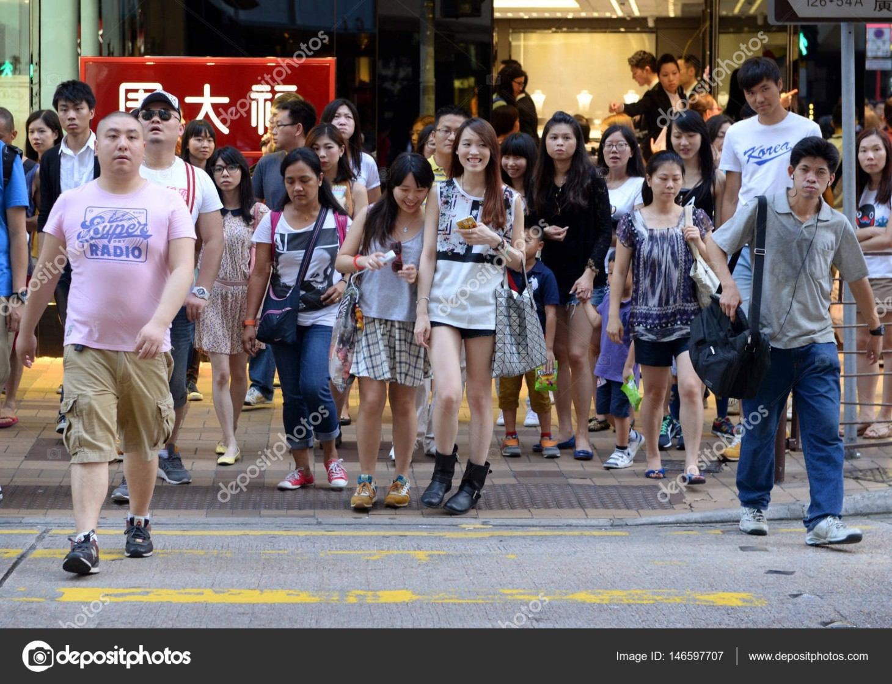
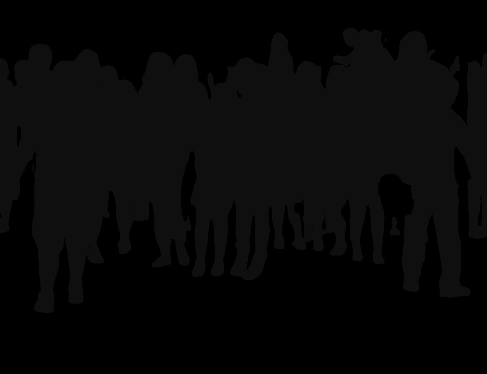
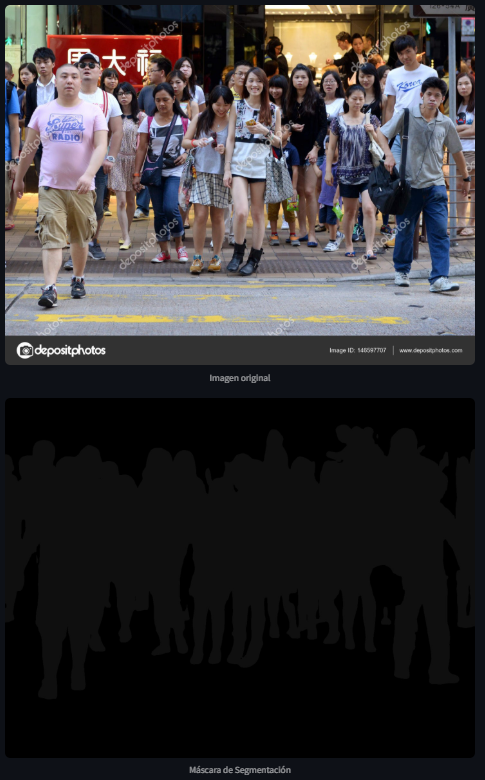

# Adrián Perogil Fernández

## Uso
[Enlace](https://apf-segmentador-gan.streamlit.app/)

## Resultado (tarda un poco en cargar cuando subas una imagen)

## Contexto histórico
**Creador**: DeepLab fue desarrollado por Google Research.  
**Cuándo se implementó**: La primera versión fue presentada en 2015 y ha evolucionado a lo largo de los años, con DeepLabV3 lanzado en 2017 y DeepLabV3+ en 2018.  
**Circunstancias**: Surgió como una solución para la segmentación semántica de imágenes, con el objetivo de mejorar la precisión en la detección de objetos y áreas dentro de una imagen. Se implementó principalmente para aplicaciones en visión por computadora, como la conducción autónoma y la interpretación de imágenes médicas.  

## Principales características y comparativa
**Características principales:**
- Utiliza convoluciones dilatadas para capturar información contextual sin pérdida de resolución.
- Integra el módulo ASPP (Atrous Spatial Pyramid Pooling) para mejorar la detección de objetos en múltiples escalas.
- Se basa en arquitecturas de redes neuronales profundas como **ResNet-101** para extraer características avanzadas.

**Comparativa:**
- Frente a U-Net: DeepLabV3 es más eficiente para grandes volúmenes de datos y mejor en segmentación en imágenes naturales.
- Frente a Mask R-CNN: DeepLabV3 es más rápido pero menos preciso en tareas de segmentación de instancias.
- Frente a Fully Convolutional Networks (FCN): DeepLabV3 maneja mejor la pérdida de resolución en imágenes de alta complejidad.

## Arquitectura
**Descripción general:**
- **Backbone**: Red neuronal convolucional (ResNet-101 o Xception).
- **Convoluciones dilatadas**: Permiten expandir el campo receptivo sin aumentar la cantidad de parámetros.
- **ASPP (Atrous Spatial Pyramid Pooling)**: Permite mejorar la segmentación en múltiples escalas.
- **Decodificador opcional**: En DeepLabV3+, se añade un módulo decodificador para mejorar detalles en los bordes de los objetos.

**Diagrama:**
- Puedes incluir un diagrama mostrando la arquitectura del modelo con sus principales componentes.

**Capas y parámetros:**
- ResNet-101 como extractor de características.
- Convoluciones con diferentes tasas de dilatación.
- Normalización BatchNorm para mejorar la estabilidad.
- Hiperparámetros clave: tasa de aprendizaje, número de capas convolucionales, función de pérdida (Cross-Entropy Loss).

## Aplicaciones y casos de uso
**Visión por computadora:** Segmentación de objetos en imágenes y vídeos.  
**Conducción autónoma:** Detección y segmentación de carreteras, peatones y vehículos.  
**Medicina:** Segmentación de órganos y tejidos en imágenes médicas como resonancias magnéticas.  
**Agricultura:** Detección de áreas cultivadas y monitoreo de vegetación mediante imágenes satelitales.  

## Enlaces de interés sobre DeepLabV3

- 📄 **Artículo original:**  
  [DeepLab: Semantic Image Segmentation with Deep Convolutional Nets](https://arxiv.org/abs/1606.00915)  

- 🎓 **Tutorial en TensorFlow para segmentación de imágenes:**  
  [TensorFlow DeepLabV3+ Tutorial](https://www.tensorflow.org/tutorials/images/segmentation)  

